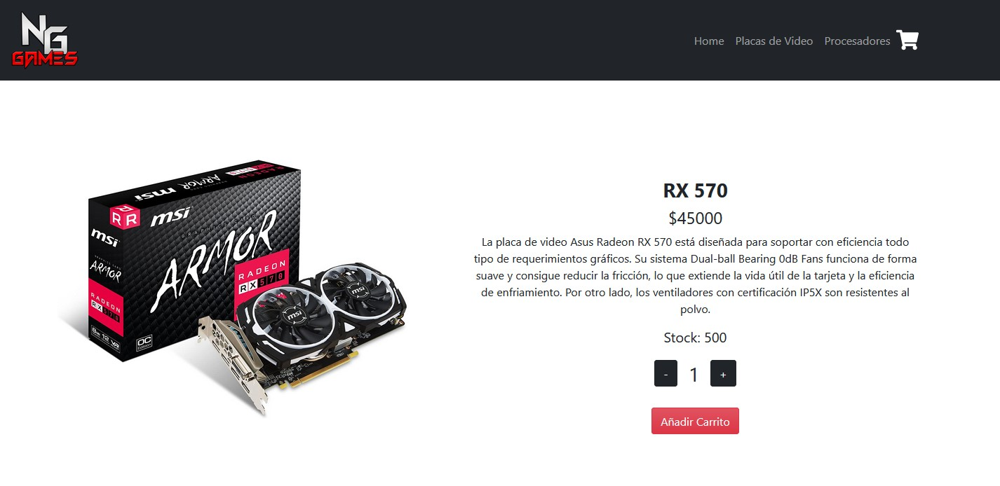
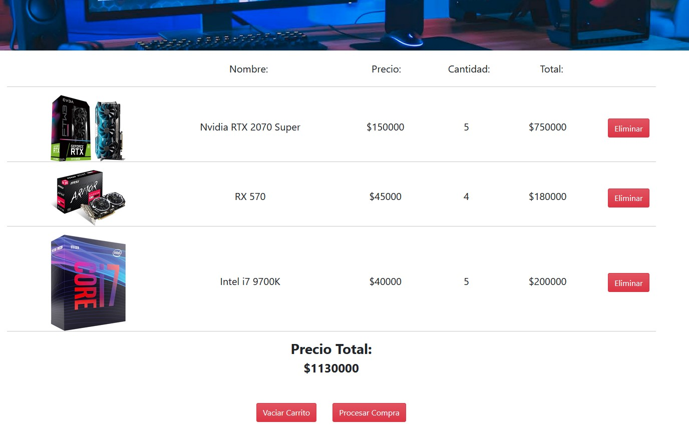
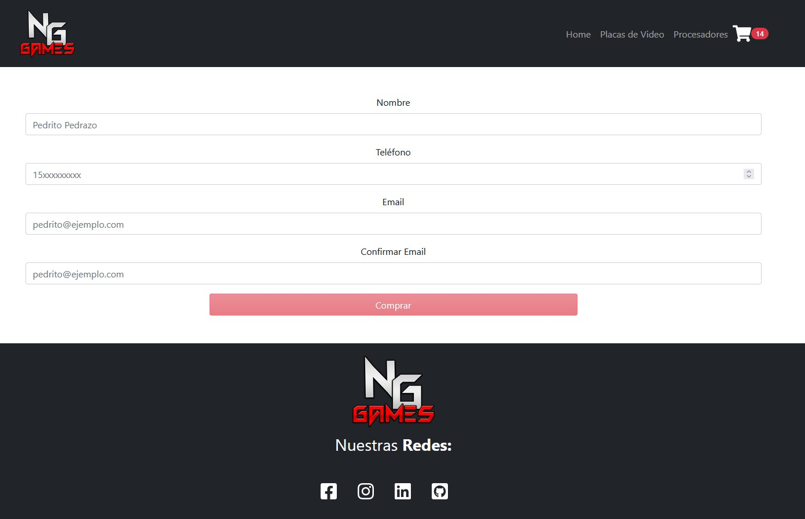

# **Proyecto Ecommerce React** 
# *Curso de React dictado por Coderhouse*
### **Matias Marrone**

# *Info:*

Este es el proyecto final del curso dictado por [CoderHouse](https://www.coderhouse.com) de React Js de la carrera Front-End.
Se trata sobre un Ecommerce, el cual está creado con Vite.
Se implementa React.js con React Router, React Hooks, Bootstrap (tanto común como React Bootstrap), React-Icons, React-Spinners, Firebase.

Ademas los productos al realizar la compra se descuentan del stock almacenado en Firebase, actualizandose en tiempo real segun la cantidad vendida.

**Capturas de pantalla:**

### 1. Home:
## 

### 2. Detalle del producto seleccionado:

## 

### 3. Carrito de compras, con productos seleccionados:

## 

### 4. Formulario para realizar la compra:

## 
### 5. Compra finalizada con éxito:

## 
